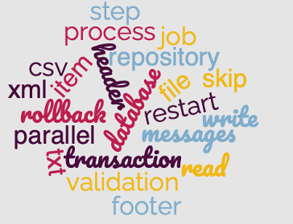

= Batch Applications

~#Rodrigo&nbsp;Graciano#~ &nbsp; &nbsp; &nbsp; &nbsp; &nbsp; &nbsp; &nbsp; &nbsp;&nbsp; &nbsp; &nbsp; &nbsp;&nbsp; &nbsp; &nbsp; &nbsp;&nbsp; &nbsp; &nbsp; &nbsp;~#Chandra&nbsp;Guntur#~ &nbsp; &nbsp; &nbsp; &nbsp;

 https://github.com/rodrigolgraciano/batch.git

'''

[caption=" ", .center, cols="<40%, ^20%, >40%", width=95%, grid=none, frame=none]
|===
|
| &nbsp;
| link:deck/docs/01_SpringBatch.adoc[#Spring Batch# ▶️]
|===