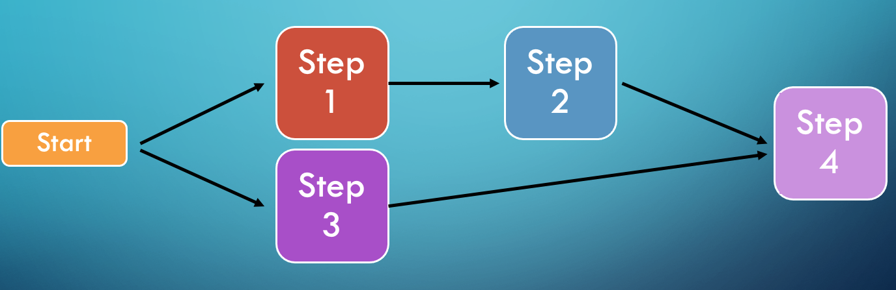

= Multiple Steps

Your job can have more than one step.
Steps flow can be:

== Sequential
image:../images/flow_sequential.png[Sequential]

== Conditional
image:../images/flow_conditional.png[Conditional]

== Split

'''

|===
| link:09_Listeners.adoc[◀️ #Listeners#] &nbsp;&nbsp;&nbsp;&nbsp;&nbsp;&nbsp;&nbsp;&nbsp; link:11_FaultTolerance.adoc[#Fault Tolerance# ▶️]
|===