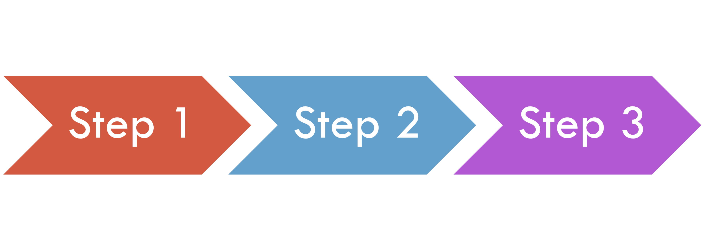

= Multiple Steps

Your job can have more than one step.
Steps flow can be:

== Sequential

'''

|===
| link:09_Listeners.adoc[◀️ #Listeners#] &nbsp;&nbsp;&nbsp;&nbsp;&nbsp;&nbsp;&nbsp;&nbsp; link:11_MultipleSteps_Conditional.adoc[#Conditional Step# ▶️]
|===