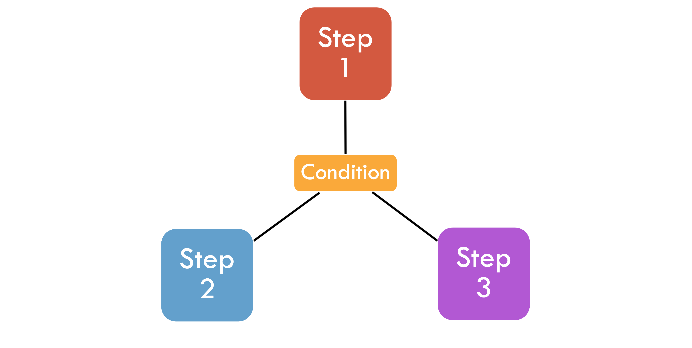

= Multiple Steps

== Conditional

'''

|===
| link:10_MultipleSteps_Sequential.adoc[◀️ #Sequential Step#] &nbsp;&nbsp;&nbsp;&nbsp;&nbsp;&nbsp;&nbsp;&nbsp; link:12_MultipleSteps_Split.adoc[#Split Step# ▶️]
|===