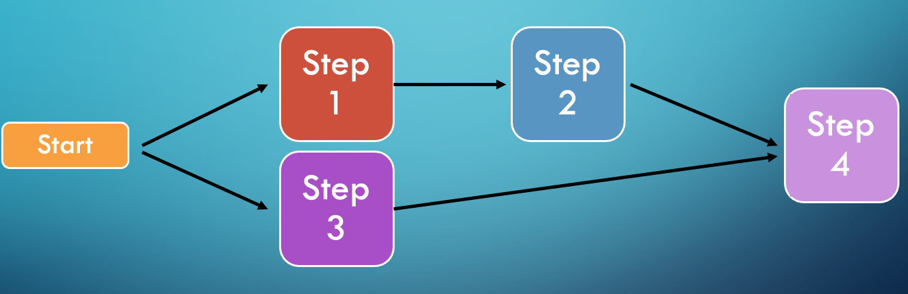

= Multiple Steps

== Split

'''

|===
| link:11_MultipleSteps_Conditional.adoc[◀️ #Conditional Step#] &nbsp;&nbsp;&nbsp;&nbsp;&nbsp;&nbsp;&nbsp;&nbsp; link:13_FaultTolerance.adoc[#Fault Tolerance# ▶️]
|===